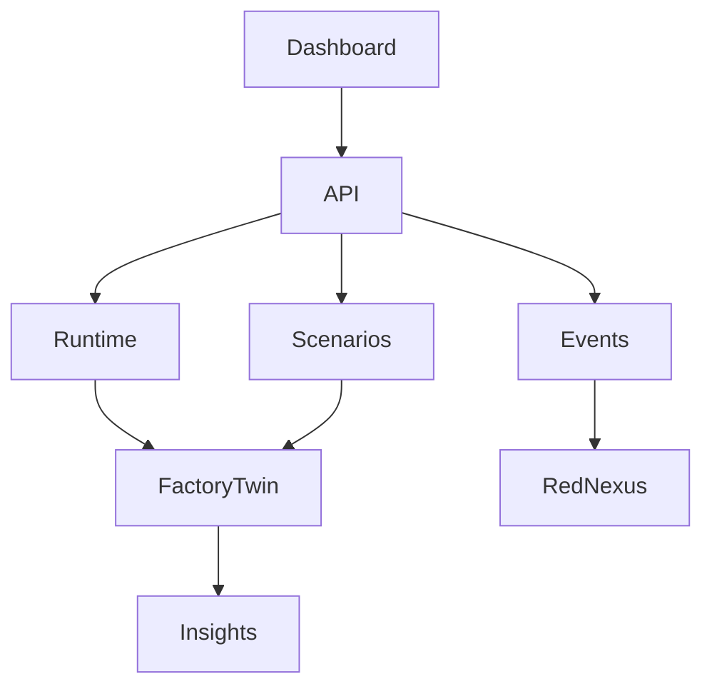

# Architecture — v1.0.0

- **Runtime** owns deterministic state transitions and telemetry.
- **Scenario Engine** applies explicit, reversible what-if mutations.
- **Insight Service** translates telemetry into explainable risk findings.
- **Event Store** emits CloudEvents-shaped messages and exposes a versioned capability document.

The v1 runtime is in-memory by design. A production deployment can replace it with an event store/TimescaleDB adapter without changing API contracts.
